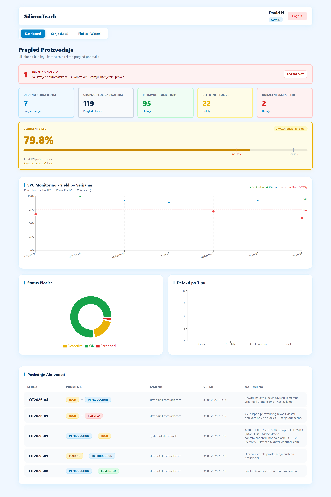
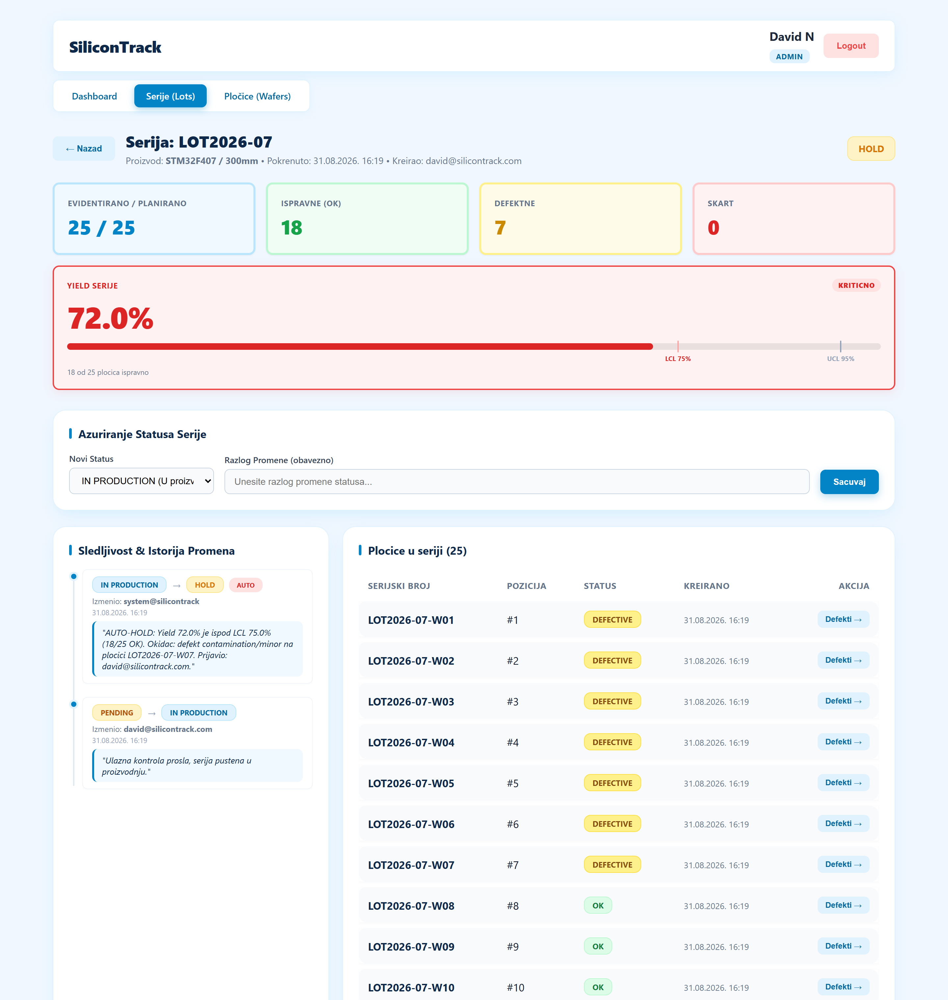
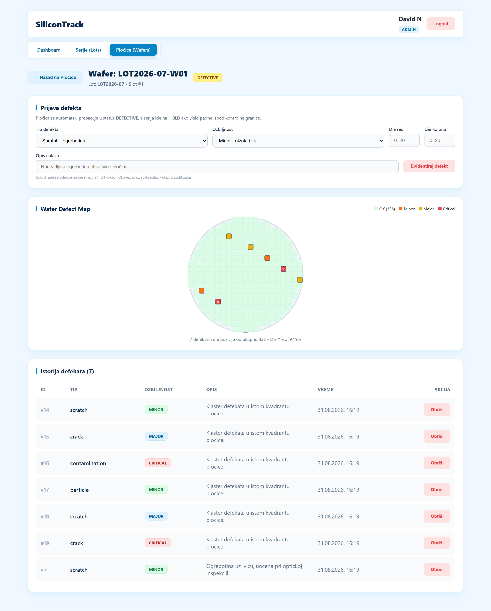
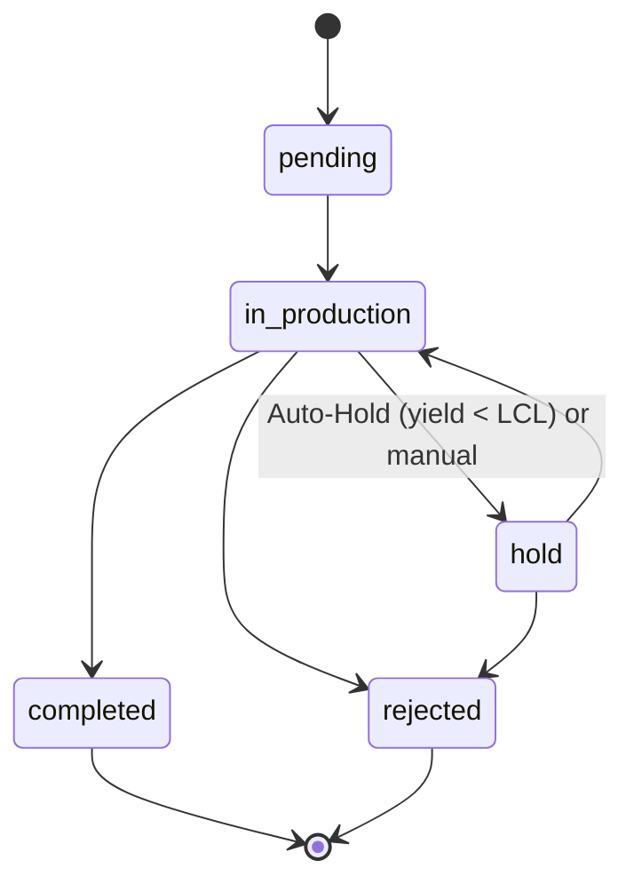

# SiliconTrack

Manufacturing Execution System (MES) for semiconductor production - lot traceability,
wafer-level defect inspection and automated SPC quality control.

**Live demo:** https://silicontrack.web.app - sign in with Google (no registration needed).

> The public demo deliberately grants every Google account the `ADMIN` role so reviewers can
> see every screen, including administration. The default role is a single environment variable
> (`GOOGLE_DEFAULT_ROLE`); in a real deployment it is set to `ROLE_VIEWER` and higher roles are
> assigned by an administrator.



---

## What it does

In semiconductor manufacturing every wafer lot must be traceable: who changed what, when and why.
SiliconTrack tracks lots through their lifecycle, records defects at die level, and - this is the core
feature - **stops a lot automatically** when its yield drops below the statistical control limit.

### Auto-Hold quality engine

When an engineer logs a defect, the system recalculates the lot yield. If it falls below the
Lower Control Limit (75%) and the sample is large enough, the lot is transitioned to `HOLD`
and an immutable audit record is written - without human intervention.


*LOT2026-07 was stopped automatically: the seventh defect dropped the yield to 72%, below the
75% control limit. The system wrote the audit entry - no human action involved.*

### Wafer defect map

300mm wafer rendered as a 21×21 die grid; each defect is placed by its die coordinates and
color-coded by severity.



---

## Features

- **Lot traceability** - enforced state machine (`pending → in_production → hold / completed / rejected`),
  final states are locked, every transition requires an engineering note
- **Immutable audit trail** - append-only history: who, what, when, why; automatic transitions are
  recorded under a dedicated system account
- **Defect inspection** - type, severity and die coordinates; wafer status updates automatically
- **SPC monitoring** - yield trend chart with UCL/LCL control limits
- **Auto-Hold engine** - automatic lot hold when yield breaches the lower control limit
- **Authentication & roles** - JWT, Google Sign-In (Firebase), role hierarchy `ADMIN > ENGINEER > VIEWER`
- **CI/CD** - GitHub Actions: Docker build → database migrations → Cloud Run → Firebase Hosting

---

## Tech stack

| Layer          | Technology                                                    |
|----------------|---------------------------------------------------------------|
| Backend        | PHP 8.2, Symfony 7, Doctrine ORM, LexikJWT, MySQL 8           |
| Frontend       | React 19, Vite, React Router, Recharts, hand-written CSS      |
| Auth           | JWT (own tokens) + Firebase Authentication for Google Sign-In |
| Infrastructure | Docker, Google Cloud Run, Firebase Hosting, GitHub Actions    |

---

## Architecture

Modular monolith. Each domain module (`Lot`, `Wafer`, `Defect`, `User`) is split into three layers,
with dependencies pointing inwards:

```
src/Lot/
├── Domain/           # entities, enums, policies, repository interfaces - no framework code
├── Application/      # commands + handlers (use cases)
└── Infrastructure/   # controllers, Doctrine repositories
```

Request flow:

```
HTTP → Controller → Command → Handler → Domain (aggregate) → Repository interface
                                                                     ↑
                                                        Doctrine implementation
```

Two decisions worth pointing out:

- **Business rules live in the domain.** Allowed lot transitions are defined on the `LotStatus`
  enum and enforced inside `Lot::changeStatus()`, which throws `InvalidLotTransitionException`.
  The application layer only orchestrates; it cannot put a lot into an invalid state.
- **SPC rules are a pure policy.** `YieldPolicy` has no dependencies (no database, no framework),
  so the quality rules are unit-testable in isolation. `AutoHoldService` reuses the existing
  `UpdateLotStatusHandler` instead of touching the entity directly, so transitions and audit
  logging always go through one door.

### Lot lifecycle



---

## Running locally

**Requirements:** PHP 8.2+, Composer, Node 20+, Docker.

```bash
git clone https://github.com/david-n0/PilotProject-siliconTrack
cd PilotProject-siliconTrack

# 1. Database (MySQL 8 in Docker)
cd backend
docker compose up -d

# 2. Backend
composer install
cp .env .env.local          # set DATABASE_URL, APP_SECRET, JWT_PASSPHRASE, FIREBASE_PROJECT_ID
php bin/console lexik:jwt:generate-keypair
php bin/console doctrine:migrations:migrate
symfony server:start

# 3. Frontend
cd ../frontend
npm install
npm run dev                 # http://localhost:5173
```

Google Sign-In needs a Firebase project with the Google provider enabled; put the web config
into `src/firebase.js` and the same project id into `FIREBASE_PROJECT_ID` on the backend.

---

## Deployment

Every push to `master` triggers the pipeline:

1. Build the Docker image and push it to Artifact Registry
2. Run Doctrine migrations against the production database
3. Deploy the backend to Cloud Run
4. Build and deploy the React client to Firebase Hosting

Database schema changes only ever reach production through committed migrations.

---

## Known limitations / next steps

Deliberately left out of this iteration:

- There are no automated tests yet. The first suite would cover `YieldPolicy`, the lot state
  transitions and `AutoHoldService` - all three are dependency-free by design, so they are
  testable without a database
- Wafer cassette position (1–25) and die coordinates are validated on the client only -
  these invariants belong in the domain
- JWT is stateless with no refresh token; expired tokens simply log the user out
- The yield trend endpoint queries wafers per lot (N+1); a single aggregated query is the fix

---

## Author

David Nikolić - [LinkedIn](https://www.linkedin.com/in/davidnikolicc/)
